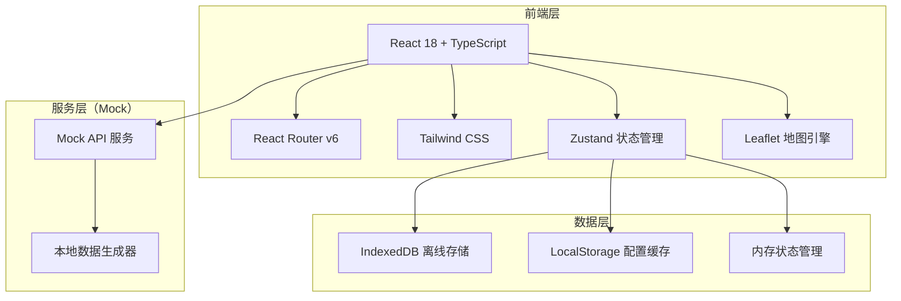
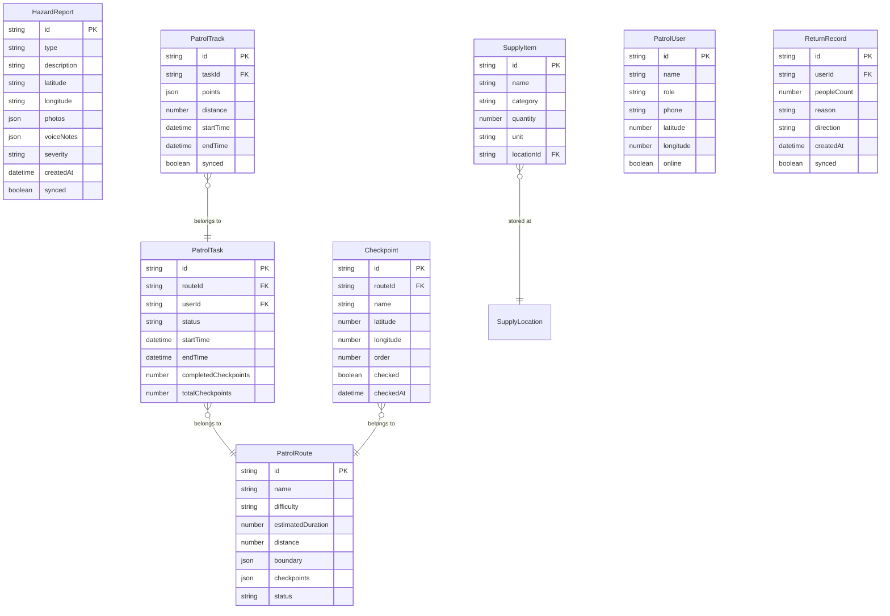

## 1. 架构设计



## 2. 技术说明

- **前端框架**：React@18 + TypeScript + Vite
- **初始化工具**：vite-init
- **样式方案**：Tailwind CSS@3
- **路由方案**：React Router DOM v6
- **状态管理**：Zustand
- **地图引擎**：Leaflet + react-leaflet（轻量、支持离线瓦片）
- **图标库**：lucide-react
- **后端服务**：无（使用 Mock 数据模拟）
- **离线存储**：IndexedDB（通过 idb 库封装） + LocalStorage

## 3. 路由定义

| 路由 | 用途 |
|------|------|
| `/` | 巡护首页 - 紧急通知、任务概览、快捷入口 |
| `/route` | 路线任务 - 路线列表、封控边界地图、到达打卡 |
| `/report` | 隐患上报 - 拍照取证、语音备注、各类上报表单 |
| `/contact` | 人员联络 - 同伴位置、一键呼叫、群组消息 |
| `/supply` | 物资点 - 物资清单、领取登记、劝返登记 |
| `/offline` | 离线包 - 离线地图、轨迹保存、数据补传 |
| `/stats` | 统计记录 - 巡护里程、统计图表、日期导出 |

## 4. 数据模型

### 4.1 数据模型定义



### 4.2 状态管理设计

```typescript
interface AppStore {
  currentUser: PatrolUser
  currentTask: PatrolTask | null
  onlineStatus: boolean
  pendingSyncCount: number
  emergencyAlerts: EmergencyAlert[]

  claimRoute: (routeId: string) => void
  checkIn: (checkpointId: string) => void
  submitReport: (report: HazardReport) => void
  syncOfflineData: () => Promise<void>
  updateLocation: (lat: number, lng: number) => void
}
```

## 5. 离线策略

| 数据类型 | 存储方式 | 同步策略 |
|----------|----------|----------|
| 巡护路线 | IndexedDB | 首次加载时缓存，定期更新 |
| 打卡记录 | IndexedDB | 离线保存，网络恢复后补传 |
| 隐患上报 | IndexedDB | 离线保存，网络恢复后补传 |
| 巡护轨迹 | IndexedDB | 离线持续记录，网络恢复后补传 |
| 地图瓦片 | IndexedDB | 提前下载指定区域 |
| 用户配置 | LocalStorage | 本地持久化 |
| 同伴位置 | 不离线存储 | 仅在线时展示 |

## 6. 项目目录结构

```
src/
├── components/          # 通用组件
│   ├── BottomNav.tsx    # 底部导航栏
│   ├── MapView.tsx      # 地图组件
│   ├── StatusBadge.tsx  # 状态徽章
│   └── SyncIndicator.tsx # 同步状态指示器
├── pages/               # 页面组件
│   ├── Home.tsx         # 巡护首页
│   ├── Route.tsx        # 路线任务
│   ├── Report.tsx       # 隐患上报
│   ├── Contact.tsx      # 人员联络
│   ├── Supply.tsx       # 物资点
│   ├── Offline.tsx      # 离线包
│   └── Stats.tsx        # 统计记录
├── store/               # Zustand 状态管理
│   └── useStore.ts      # 全局状态
├── hooks/               # 自定义 Hooks
│   ├── useGeolocation.ts # 定位 Hook
│   ├── useOnlineStatus.ts # 网络状态 Hook
│   └── useOfflineSync.ts  # 离线同步 Hook
├── utils/               # 工具函数
│   ├── mockData.ts      # Mock 数据生成
│   └── db.ts            # IndexedDB 封装
├── App.tsx              # 应用入口
└── main.tsx             # 渲染入口
```
